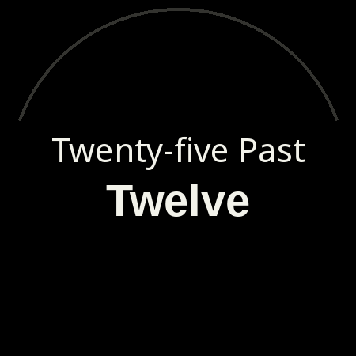

# Fuzzy Time GB

A minimal word-based Watch Face Format face for Wear OS. It displays fuzzy
British English time phrases based on the C logic from the Pebble watchface [fuzzy-time-gb](https://github.com/nedrichards/fuzzy-time-gb).

The Android app module is resource-only: `android:hasCode="false"` and WFF
version 2. The helper script in `tools/` regenerates the declarative XML, but it
is not packaged into the watch face APK.

The optional Arvo style bundles the Arvo typeface, licensed under the SIL Open
Font License 1.1. See `licenses/Arvo-OFL.txt`. Release asset generation also
vendors Liberation Sans under the same license; see
`licenses/LiberationFonts-OFL-1.1.txt`.



## Build

The project uses Gradle 9, Android Gradle Plugin 9, and Watch Face Format v2.
Gradle is configured to run the build daemon with a JetBrains JDK 21 toolchain
from `gradle/gradle-daemon-jvm.properties`; if a matching JDK is not available
locally, Gradle can provision one via the Foojay resolver configured in
`settings.gradle.kts`.

```sh
./gradlew :watchface:assembleDebug
```

On local machines that do not have `ANDROID_HOME` configured globally, point the
wrapper at your Android SDK:

```sh
env ANDROID_HOME=/var/home/nedr/Android/Sdk \
  ANDROID_SDK_ROOT=/var/home/nedr/Android/Sdk \
  ./gradlew :watchface:assembleDebug
```

## Regenerate Watch Face XML

```sh
python3 tools/generate_watchface.py
```

## Regenerate Release Assets

```sh
python3 tools/generate_release_assets.py
```

## Validate WFF

```sh
java -jar tools/wff-validator.jar 2 watchface/src/main/res/raw/watchface.xml
```

---
*Co-authored with a bunch of different AIs*